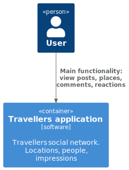
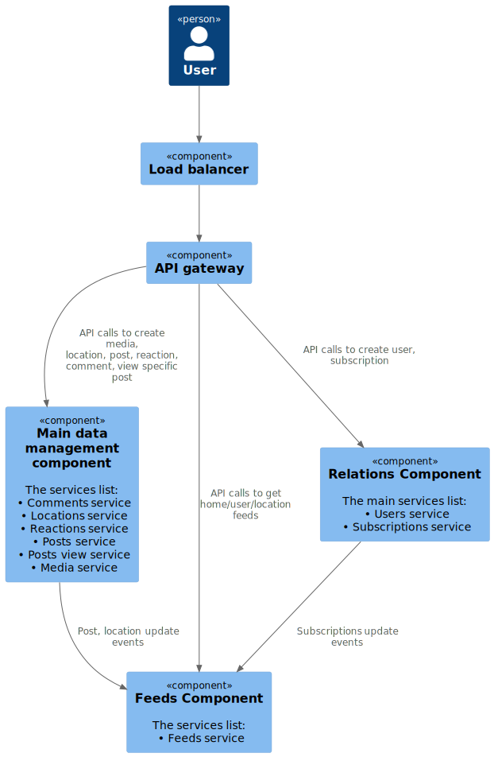
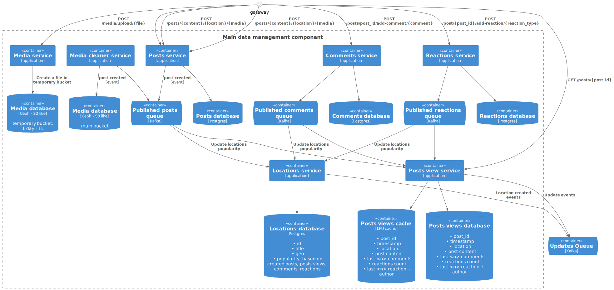
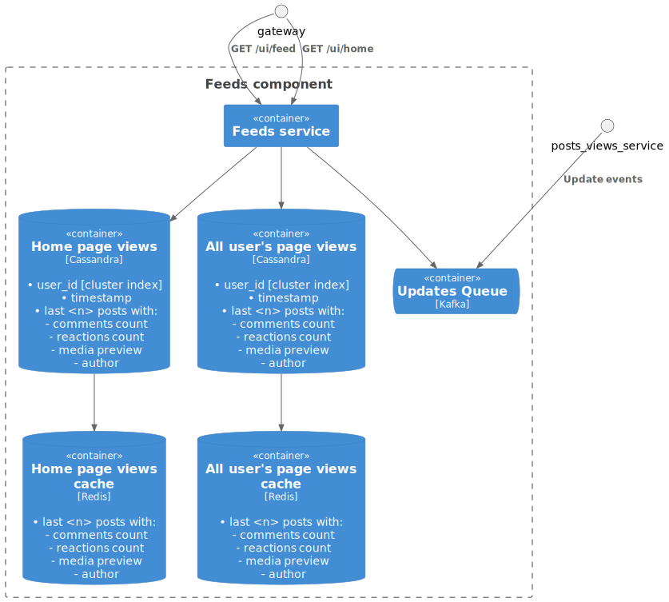
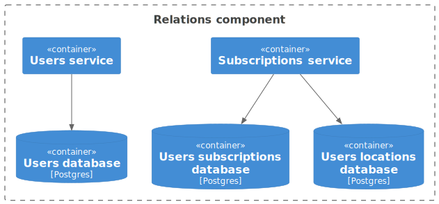
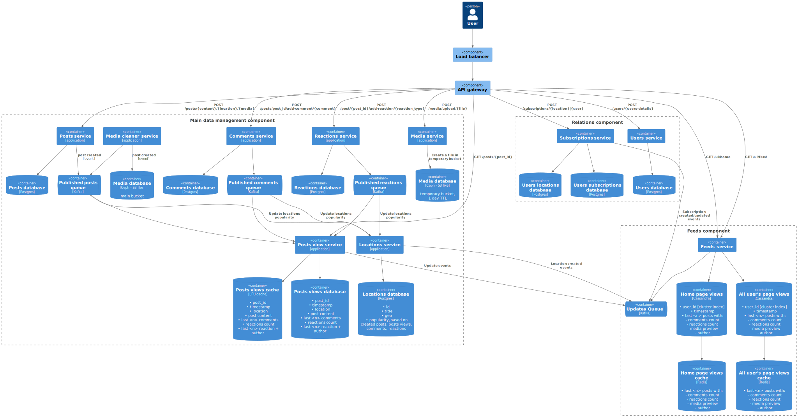

# System Design of a Social Network for a [System Design Course](https://balun.courses/courses/system_design)

## Features

### 1. Post publishing

* **Description**: Users should be able to publish posts about their travels.
* **Requirements**
  * ability to upload and display photos.
  * provide a text field for a short description of the travel experience.
  * geotagging to associate posts with specific travel locations.


### 2. Post interaction

* **Description**: Users should be able to engage with posts from other travelers.
* **Requirements**:
  * allow users to like and comment on posts.
  * display the number of likes and comments on each post.

### 3. User Subscriptions

* **Description**: Users should be able to subscribe to other travelers to follow their activity.
* **Requirements**:
  * ability to follow and unfollow other users.
  * display a feed of posts from followed users.

### 4. Location-Based Search

* **Description**: Users should be able to find popular travel destinations and view related posts.

**Requirements**:
search functionality to find destinations by name or region.
display a list of popular locations based on user activity.
allow users to browse posts related to specific locations.

### 5. Traveler Feed
* Description: Users should be able to view a feed of posts from other travelers.
* Requirements:
  * display a chronological feed of posts from all users.
  * option to filter the feed by location, popularity, or time.
  * infinite scrolling for continuous browsing of the feed.

### 6. Security
* Description: Implement user authentication and data protection measures.
* Requirements:
  * a user should be able to register to app
  * all pages except landing page should be protected from guest's views

## Non-functional requirements

* **Scalability**: The platform should be designed to handle a growing number of users and posts. 
  * From 0 up to 10,000,000 active daily users
* **Performance**: Optimize loading times for images and feeds to ensure a smooth user experience.
  * feed pages should load within 1-seconds at worst, .5 seconds at average
* **User Interface**: The design should be intuitive and mobile-friendly to accommodate travelers using the platform on various devices.
  * desktop devices ~ 1920×1080 
  * tablet devices ~ 1280×800
  * mobile devices ~ 720×1160

### Application Audience
* User base: 10,000,000 DAO within the first year after launch, with further growth expected.
* Users behaviour: 
  * 2—3 visited feeds page per day 
  * 5—6 visited post page per day 
  * 1-2 post per week
  * comments 5-6 per week
  * reactions 10-12 per week
  * average comments for post 10

### Application Features
* Seasonality in the application: no seasonal changes expected so far. 
* Data storage conditions: all data stores forever
* Limits and restrictions: a user may create not more than 100 posts per day
* Time constraints
  * feed page should be fully loaded within 1 second
  * a post should be visible after 5 seconds
  * location search within a 1 second
* Application Availability
  * No more than a few hours of downtime per year

## Design overview

### Level 1. System context diagram



### Level 2. Core system container diagram



### Level 3. Posts, comments, reactions, locations component



### Level 3. Feeds component



### Level 3. Users, subscriptions component



### Full scheme



[Alternative scheme](images/full-view-figma.svg)

## Calculations

### RPS (feed view)
```shell
DAU = 10 000 000
RPS = 10 000 000 * 3 / 86 400 ~ 350
RPS media = 10 000 000 * 3(feed pages) * 30(posts in feed) * 10(media in post) / 86 400 ~ 105 000
```

### RPS (post view)
```shell
RPS = 10 000 000 * 6 / 86 400 ~ 700
```

### RPS (publish post)
```shell
DAU = 10 000 000
RPS = 10 000 000 * 2 / 86 400 / 7 ~ 33
```

### RPS (comments)
```shell
DAU = 10 000 000
RPS(publish) = 10 000 000 * 6 / 86 400 / 7 ~ 100
RPS(read) = 10 000 000 * 6 * 10 / 86 400 / 7 ~ 992
```

### RPS (reactions)
```shell
DAU = 10 000 000
RPS = 10 000 000 * 12 / 86 400 / 7 ~ 200
```

### Post parameters
```shell
text: ~10kb
photo: ~200kb
photos is post: ~4-6
average post size: 10Kb
average post with media size: 10 + 200 * 6 ~ 1.2Mb
average comments for post: 10
```

### Traffic(feed view)
```shell
posts in a feed: ~20-30
traffic = 350 * 30 * 1.2Mb = 12 Gb/s
traffic posts = 350 * 30 * 10Kb = 105 Mb/s
traffic media = 350 * 30 * 1.2Mb = 12 Gb/s
```

### Traffic(post view)
```shell
media in a post: ~5-10
traffic = 350 * 30 * 1.2Mb = 12 Gb/s
traffic posts = 350 * 30 * 10Kb = 105 Mb/s
traffic media = 350 * 30 * 1.2Mb = 12 Gb/s
```

### Traffic(publish post)
```shell
traffic posts media = 33 * 1.2mb = 40 Mb/s
traffic posts = 33 * 10Kb = 330 Kb/s
```

### Traffic(comments)
```shell
comment size: 100B
traffic(save) = 100 * 100B = 10 Kb/s
traffic(read) = 992 * 100B = 100 Kb/s
```

### Traffic(reactions)
```shell
reaction size: 10b
traffic = 100 * 10b = 1 Kb/s
```

### Connections
```shell
1 000 000
```

## Hardware

1. Posts media
   * Capacity: `40 Mb/s * 86400 * 365 ~ 1200 Tb`
     1. HDD
     * Disks for capacity: `1200 Tb / 32 Tb ~ 40`
     * Disks for throughput(saving data): `40 Mb/s / 100 Mb/s ~ 1`
     * Disks for throughput(reading data): `12 Gb/s / 100 Mb/s ~ 120`
     * Disks for iops: `105 000 / 100 ~ 1050`
     * Disks: `120`
     2. SSD(SATA)
     * Disks for capacity: `1200Tb / 100Tb ~ 12`
     * Disks for throughput (saving): `40 Mb/s / 500 Mb/s ~ 1`
     * Disks for throughput (reading): `12 Gb/s / 500 Mb/s ~ 24`
     * Disks for iops: `105 000 / 500 ~ 210`
     * Disks: `210`
1. Posts content
   * Capacity: `330 Kb/s * 86400 * 365 ~ 10Tb`
     1. HDD
     * Disks for capacity: `10Tb / 32Tb ~ 1`
     * Disks for throughput(saving data): `330 Kb/s / 100 Mb/s ~ 1`
     * Disks for throughput(reading data): `105 MB/s / 100 Mb/s ~ 2`
     * Disks for iops: `350 / 100 ~ 4`
     * Disks: `4`
     2. SSD(SATA)
     * Disks for capacity: `10Tb / 100Tb ~ 1`
     * Disks for throughput (saving): `330 Kb/s / 500 Mb/s ~ 1`
     * Disks for throughput (reading): `105 MB/s / 500 Mb/s ~ 1`
     * Disks for iops: `350 / 500 ~ 1`
     * Disks: `1`
1. Comments
   * Capacity: `10 Kb/s * 86400 * 365 ~ 315 Gb`
   1. HDD
      * Disks for capacity: `315Gb/ 100Tb ~ 1`
      * Disks for throughput(saving): `10Kb/s / 100Mb/s ~ 1`
      * Disks for throughput(reading): `100Kb/s / 100Mb/s ~ 1`
      * Disks for iops: `100 / 100 ~ 1`
      * Disks: `1`
   2. SSD(SATA)
      * Disks for capacity: `315Gb/ 500Tb ~ 1`
      * Disks for throughput(saving): `10Kb/s / 500Mb/s ~ 1`
      * Disks for throughput(reading): `100Kb/s / 500Mb/s ~ 1`
      * Disks for iops: `100 / 500 ~ 1`
      * Disks: `1`
1. Reactions
   * Capacity: `1Kb/s * 86400 * 365 ~ 32Gb`
   * Disks for capacity: `32Gb / 32Tb ~ 1`
   * Disks for throughput: `1Kb/s / 100Mb/s ~ 1`
   * Disks for iops: `200 / 100 ~ 2`
   * Disks: `2`

### Hosts

Replication as master-slave, async, replication factor 2

1. Posts
   1. HDD
    * Hosts: `120 / 2 = 60`
    * Hosts_with_replication: `60 * 2 = 120`
   2. SSD(SATA)
    * Hosts: `24 / 2 = 12`
    * Hosts_with_replication: `12 * 2 = 24`
1. Comments
   1. HDD
    * Hosts: `1 / 2 = 1`
    * Hosts_with_replication: `1 * 2 = 2`
   2. SSD(SATA)
    * Hosts: `1 / 2 = 1`
    * Hosts_with_replication: `1 * 2 = 2`
1. Reactions
   * Hosts: `2 / 2 = 1`
   * Hosts_with_replication: `1 * 2 = 2`

## Data scheme

https://dbdiagram.io/d/emoving-66b9f2568b4bb5230edf636b
